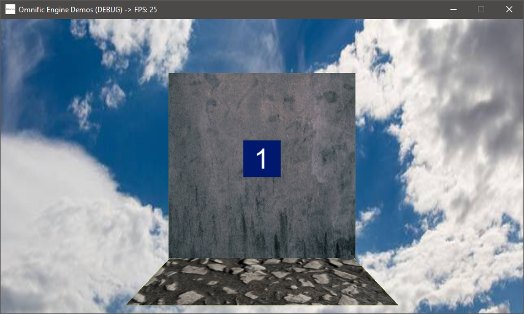

# [Omnific Engine](https://github.com/Jean-LouisH/Omnific_Engine)

**This project is still a work in progress**

[Omnific Engine](https://github.com/Jean-LouisH/Omnific_Engine) is a game engine I'm developing for fun, study and technical demonstrations. It is designed to be general purpose, data-driven, and lightweight. It is designed for games, but it is also ideally suitable for interactive, multimedia applications. For now it is targeted to PC Windows and Linux desktop platforms.

"Omnific" means ["all-creating."](https://www.merriam-webster.com/dictionary/omnific)

## Notable Features

- Project-based, data-driven Applications
- Scene Tree Hierarchy of 2D/3D Entities
- Scene EventBus for a publish/subscribe architecture
- Entity-Component-System (ECS) architecture
- C++ scripting via Native shared library builds
- Python scripting via a Virtual Machine
- OpenGL Rendering Context with GLSL
- Game Controller and Haptic Feedback support

## Notable Planned Features

- UI Framework built with UI Components and the UI System
- An Editor Application built with the Engine, C++ and Python scripting
- Data-oriented Component property access using a ComponentPropertyPool for Systems
- Multithreaded Systems
- Physically Based Rendering
- Vulkan Rendering Context with SPIR-V
- Acoustic Audio Simulation
- Network Access for peer-to-peer gameplay

## Compilation Instructions

* Requires the [SDL2](https://www.libsdl.org/), [SDL2_mixer](https://www.libsdl.org/projects/SDL_mixer/) and Python 3.7 libraries for your development platform.
* Include this source directory in CMake to generate a project from the top level CMakeLists.txt. 
* Set the `CMAKE_CONFIGURATION_TYPES` to the build configuration you want. 
* Use your C++ IDE or compiler of choice to build Esi and Tests from the project.

## Documentation

* [Objectives](Documentation/Objectives/Objectives.md)
* [Design](Documentation/Design/Design.md)
* [End User Manual](Documentation/End_User_Manual/End_User_Manual.md)
* [Scripting API](Documentation/End_User_Manual/Scripting_API/Scripting_API.md)

## Demos

Simple Clock

## License

[MIT License](LICENSE)