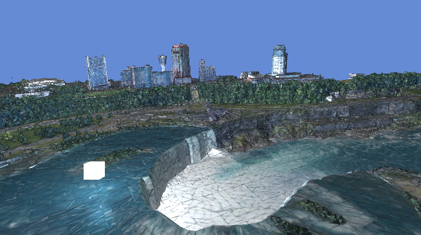
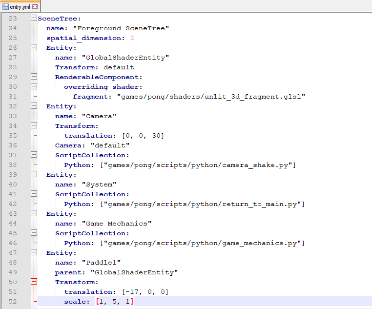
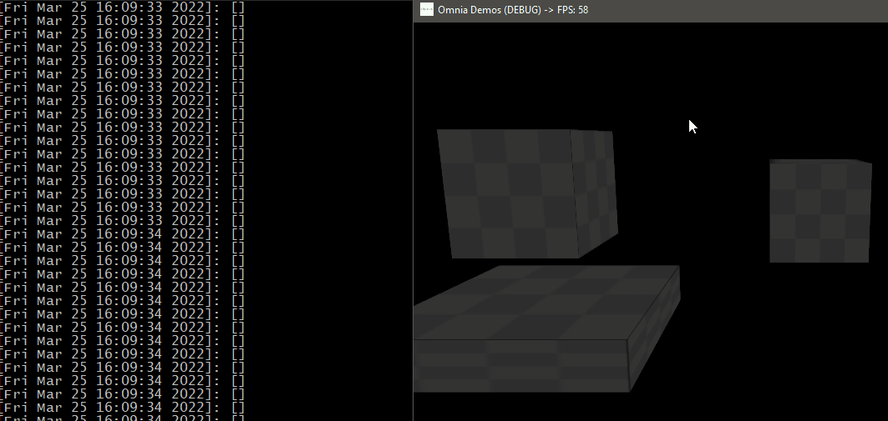
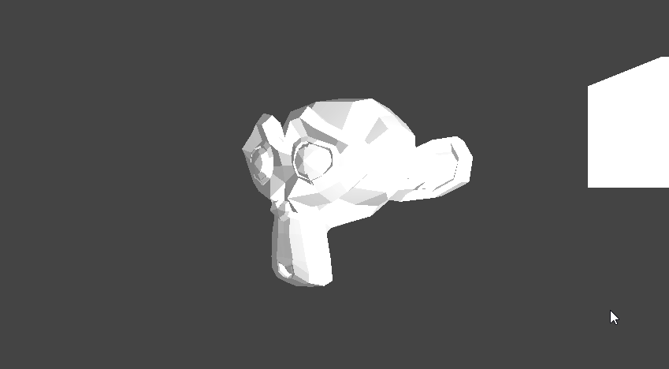
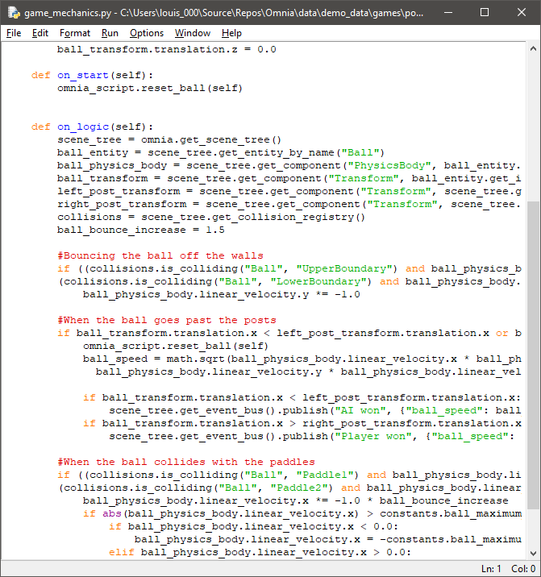
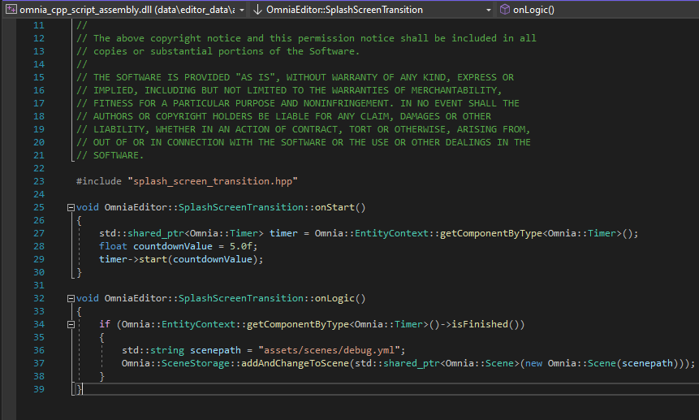
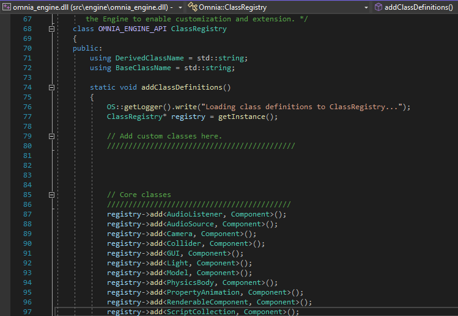
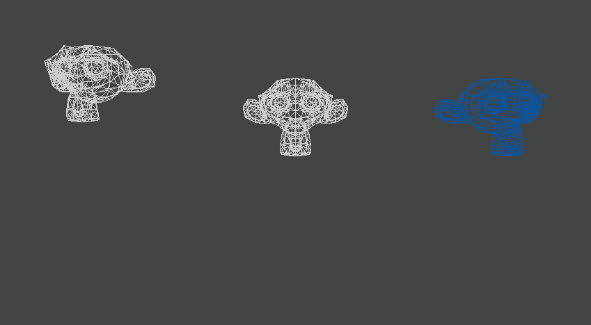
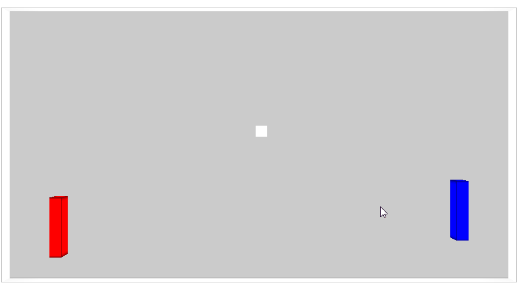

# [Omnific](https://github.com/Jean-LouisH/Omnific)

_["Niagara Falls" by Brian Trepanier](https://sketchfab.com/3d-models/niagara-falls-ontario-canada-1799ed0c63394570beed917b99807915) stored in a Model Component in a Scene and rendered in Omnific's RenderingSystem with a basic phong Shader. The white cube contains a Light Component and is rendered with a separate unlit Shader._

[Omnific](https://github.com/Jean-LouisH/Omnific) is a game engine I'm developing for fun, study and technical demonstrations. It: doubles as an interactive software framework; is designed to be customizable, general purpose, data-driven, and lightweight; and builds to Windows, Linux and Web platforms.

# Table of Contents

* [Notable Features](#notable-features)
* [Architecture](#architecture)
* [Dependencies](#dependencies)
* [Compilation Instructions](#compilation-instructions)
* [Manual](#manual)
* [Demos](#demos)
* [License](#license)

# Notable Features

- Project-based, data-driven applications, deserialized from YAML files via [yaml-cpp](https://github.com/jbeder/yaml-cpp)

- EventBus for a publish/subscribe architecture

- Model loading via TinyGLTF, including Mesh and Material texture maps

- Python VM scripting via pybind11 with game loop calls to Python and Engine API calls from Python. Imports, including pip installed packages are supported.

- C++ scripting via native shared library builds

- Fully customizable as a core framework loading custom Component and System classes on initialization

- Entity-Component-System (ECS) architecture
- Game Controller and Haptic Feedback support
- Multithreaded Systems

# Architecture

Omnific functions by retaining a collection of Scenes and processing them in a main Engine class. On every loop, one active Scene is passed to the Engine's collection of Systems where each of them can update the Scene and or generate outputs from it. 

Scenes are generated through deserializing YAML files. Each Scene consists of collections of Entities and Components. It is also augmented with collections of IDs that help to optimize search queries on it, in real-time, to constant time complexity. 

An Entity represents an object that exists in the Scene. It mostly consists of IDs for other Entities that form a tree-like relationship with it through a parent ID and a list of child IDs. It also has a dictionary of component IDs that are attached to it.

Components are data containers for their host Entities. Their data are specialized for specific ways in which an Entity is expected to be represented. For example, an Entity with a Transform and Model Component attached to it is capable of existing in physical locations as a visible 2D/3D object. With a PhysicsBody Component added to that, it would be capable of falling under gravity. Finally, with a ScriptCollection Component added to that, it would be able to override the properties of the PhysicsBody and Model and effectively store any additional data or have the Entity behave in any other way the developer wishes. 

_Animation showing three monkeys lined up with one stationary (Transform only), another falling under gravity (with a PhysicsBody), and another falling while zig-zagging and changing colour (with a ScriptCollection)._

Components may contain Assets, which are immutable objects containing resource data from memory or files. Some examples of these are Images and AudioStreams. Assets may appear in other parts of the Engine as needed, such as the Image object in the Window icon generation in Engine start up. Assets are immutable so that they may be reliably cached and instanced in Systems that need them to be constant, such as Images that represent textures in a cache that are already uploaded to the GPU in a RenderingSystem. If the Image were changeable in this case, the Image data would not match with the texture data in the GPU but would represent it in the texture cache. Consequently, the user would never see a change in texture on screen.

Scenes, Entities, Components, and Assets all retain IDs for caching wherever needed.

Systems process Scenes by events in the Engine loops. These include "on_input", "on_entity_start", "on_early_update", "on_update", "on_fixed_update", "on_late_update", "on_entity_finish" and "on_output". "on_input" represents the event in which an input state is changed. "on_entity_start" and "on_entity_finish" represent the events in which the Scenes would address Entities that are newly created or about to be deleted. "on_early_update", "on_update", "on_late_update" in that order represent a linear chain of events, that allow operations to be done in a specific order. "on_fixed_update" is an event that enables the System to have fixed updates to real-time by catching up to dropped frames and simulation lag. This can be CPU intensive, so should it be reserved to small, optimized processes that depend on it. "on_output" represents an event where processing occurs on a separate output thread to all of the other event names. Operations here are expected to be read-only.

Users can also extend the Engine through the ClassRegistry header where their own custom Components or Systems can be made and instantiated in the ClassRegistry.add_definitions() method.

# Compilation Instructions

* Git clone and install [Vcpkg](https://vcpkg.io/en/). Assign the path to the environment variable "VCPKG_ROOT".
* Git clone and install [Emscripten SDK](https://github.com/emscripten-core/emsdk). Assign the path to the environment variable "EMSDK_ROOT".
* Include this source directory in CMake to generate a project from the top level CMakeLists.txt.
* Set the `CMAKE_CONFIGURATION_TYPES` to the build configuration you want.
* Use your C++ IDE or compiler of choice to build Omnific from the project.
* To be able to install third-party packages in the embedded Python build, uncomment the last line in python*._pth. Then download [get-pip.py](https://bootstrap.pypa.io/get-pip.py), place it in the embeddable python folder, and run `> python get-pip.py`. Install packages to the embeddable folder with `> python -m pip install package-name`.

# Manual

# Demos

- [Pong](https://github.com/Jean-LouisH/Omnific/releases/tag/0.1)

# License

MIT License

Copyright (c) 2020 Jean-Louis Haywood

Permission is hereby granted, free of charge, to any person obtaining a copy
of this software and associated documentation files (the "Software"), to deal
in the Software without restriction, including without limitation the rights
to use, copy, modify, merge, publish, distribute, sublicense, and/or sell
copies of the Software, and to permit persons to whom the Software is
furnished to do so, subject to the following conditions:

The above copyright notice and this permission notice shall be included in all
copies or substantial portions of the Software.

THE SOFTWARE IS PROVIDED "AS IS", WITHOUT WARRANTY OF ANY KIND, EXPRESS OR
IMPLIED, INCLUDING BUT NOT LIMITED TO THE WARRANTIES OF MERCHANTABILITY,
FITNESS FOR A PARTICULAR PURPOSE AND NONINFRINGEMENT. IN NO EVENT SHALL THE
AUTHORS OR COPYRIGHT HOLDERS BE LIABLE FOR ANY CLAIM, DAMAGES OR OTHER
LIABILITY, WHETHER IN AN ACTION OF CONTRACT, TORT OR OTHERWISE, ARISING FROM,
OUT OF OR IN CONNECTION WITH THE SOFTWARE OR THE USE OR OTHER DEALINGS IN THE
SOFTWARE.
