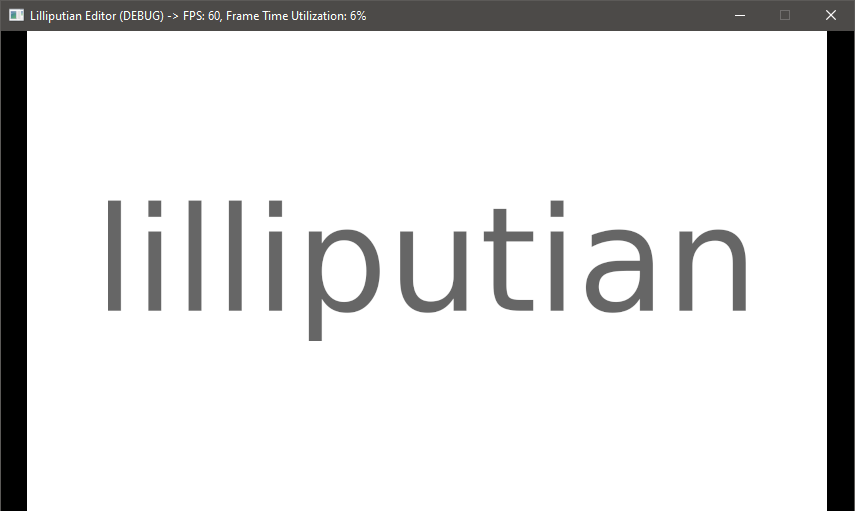
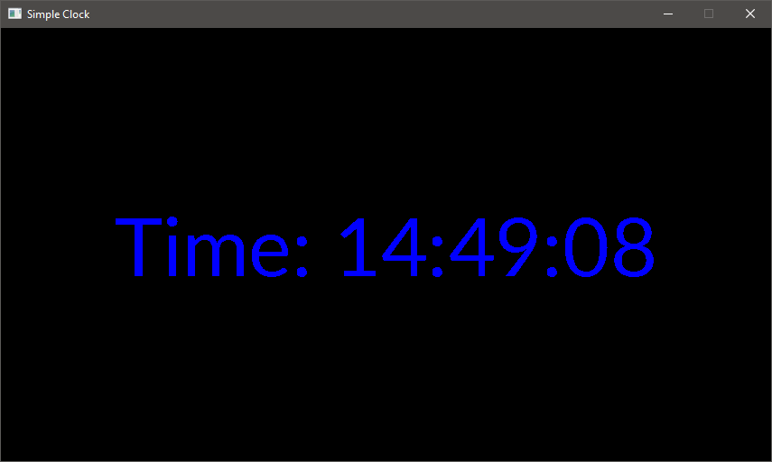

# [Lilliputian](https://github.com/Jean-LouisH/Lilliputian)

**This project is still a work in progress**

[Lilliputian](https://github.com/Jean-LouisH/Lilliputian) is **a tiny 2D game engine and IDE** for introductory game development, prototyping and programming learning. Its sole purpose is to provide the user with the entire development process in a single application and make it as simple as possible.

It is named after the tiny inhabitants of the fictional Lilliput island that appears in Jonathan Swift's 1726 novel "Guilliver's Travels." This reflects the objective of keeping the engine as small as necessary.

## Notable Target Features

- [ ] Scene Editor and IDE
- [x] Python Scripting
- [ ] Scripting APIs
- [ ] Game Executable Exporting
- [x] Mouse, Keyboard and Game Controller Support
- [x] Haptic Feedback Support
- [x] JPG and PNG Support for Sprites and Animation
- [ ] OGG and WAV Support for Audio Sources
- [ ] Procedural Geometric Primitive Objects (Rectangles, Triangles, Regular Polygons)
- [ ] Physics, Collision Detection and Response
- [x] Multiple and Independent 2D Scene Trees in one Scene Forest (For Backgrounds, Game Environment, HUD, etc)

## Compilation Instructions

* Requires the [SDL2](https://www.libsdl.org/), [SDL2_image](https://www.libsdl.org/projects/SDL_image/), [SDL_ttf](https://www.libsdl.org/projects/SDL_ttf/), [SDL2_mixer](https://www.libsdl.org/projects/SDL_mixer/) and Python 3.7 libraries for your development platform.
* Include this source directory in CMake to generate a project from the top level CMakeLists.txt. 
* Set the `CMAKE_CONFIGURATION_TYPES` to the build configuration you want. 
* Use your C++ IDE or compiler of choice to build Lilliputian and Tests from the project.

## Documentation

* [Objectives](Documentation/Objectives/Objectives.md)
* [Design](Documentation/Design/Design.md)
* [End User Manual](Documentation/End_User_Manual/End_User_Manual.md)
* [Scripting API](Documentation/End_User_Manual/Scripting_API/Scripting_API.md)

## Demos

Simple Clock

## Contributing

* Jean-Louis Haywood (Jean-LouisH)

## License

[MIT License](LICENSE)