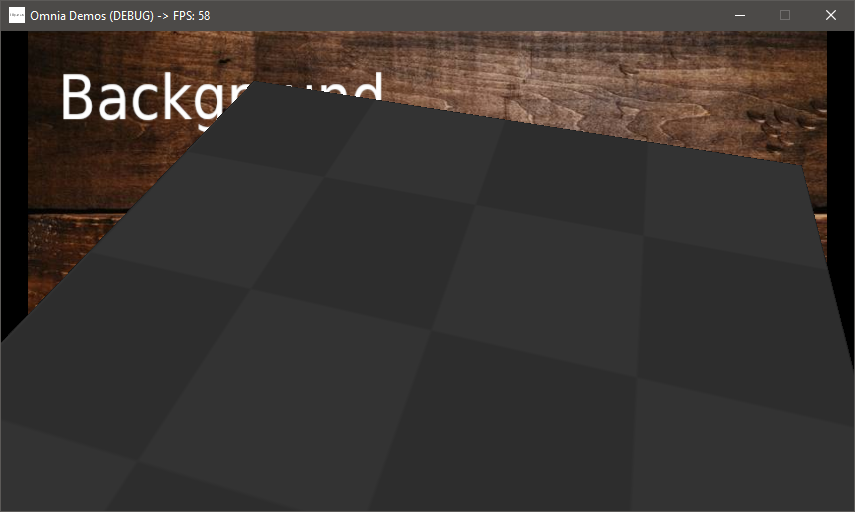
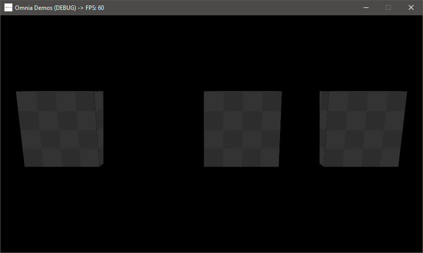

# [Omnia](https://github.com/Jean-LouisH/Omnia)

**This project is still a work in progress**

[Omnia](https://github.com/Jean-LouisH/Omnia) is a game engine I'm developing for fun, study and technical demonstrations. It doubles as a real-time software framework for interactive applications. It is designed to be general purpose, data-driven, and lightweight.

The name "Omnia" stems from the prefix "Omni-" which means "all." It is loosely based on the term "Omnific" which means ["all-creating"](https://www.merriam-webster.com/dictionary/omnific).

## Notable Features

- Project-based, data-driven Applications

- Scenes of multiple SceneTree layers (2D and 3D)

- SceneTree EventBus for a publish/subscribe architecture

- C++ scripting via Native shared library builds
- Python scripting via a Virtual Machine
- Entity-Component-System (ECS) architecture
- OpenGL Rendering Context with GLSL
- Game Controller and Haptic Feedback support

## Notable Planned Features

- UI Framework built with UI Components and the UI System
- Physically Based Rendering
- An Editor Application built with the Engine, C++ and Python scripting
- Acoustic Audio Simulation
- Multithreaded Systems
- Data-oriented Component property access using a ComponentPropertyPool for Systems
- Vulkan Rendering Context with SPIR-V
- Network Access for peer-to-peer gameplay

## Compilation Instructions

* Requires the [SDL2](https://www.libsdl.org/), [SDL2_mixer](https://www.libsdl.org/projects/SDL_mixer/) and Python 3.7 libraries for your development platform.
* Include this source directory in CMake to generate a project from the top level CMakeLists.txt. 
* Set the `CMAKE_CONFIGURATION_TYPES` to the build configuration you want. 
* Use your C++ IDE or compiler of choice to build Esi and Tests from the project.

## Documentation

* [Objectives](Documentation/Objectives/Objectives.md)
* [Design](Documentation/Design/Design.md)
* [End User Manual](Documentation/End_User_Manual/End_User_Manual.md)
* [Scripting API](Documentation/End_User_Manual/Scripting_API/Scripting_API.md)

## Demos

Simple Clock

## License

[MIT License](LICENSE)