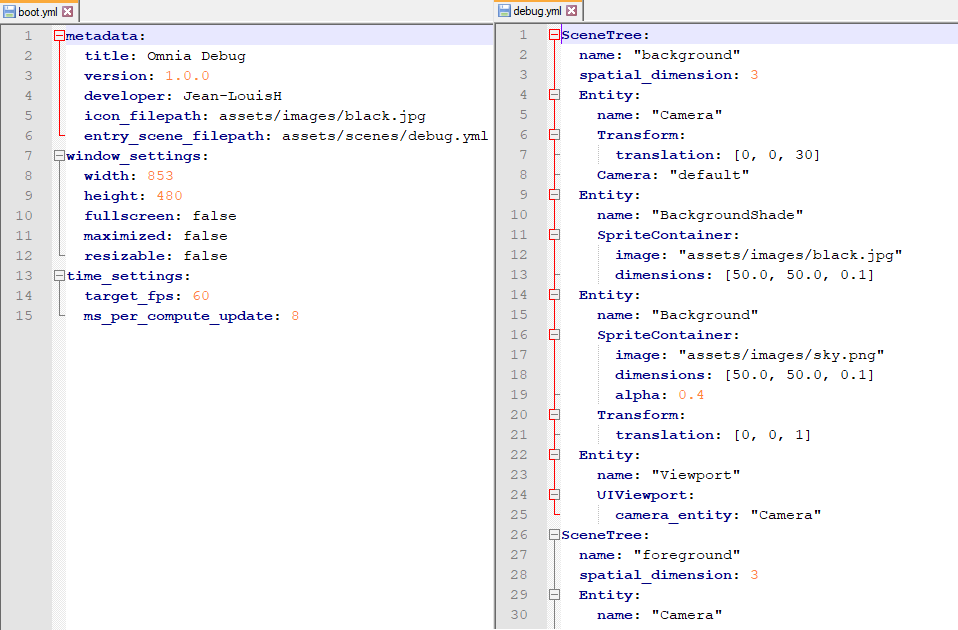
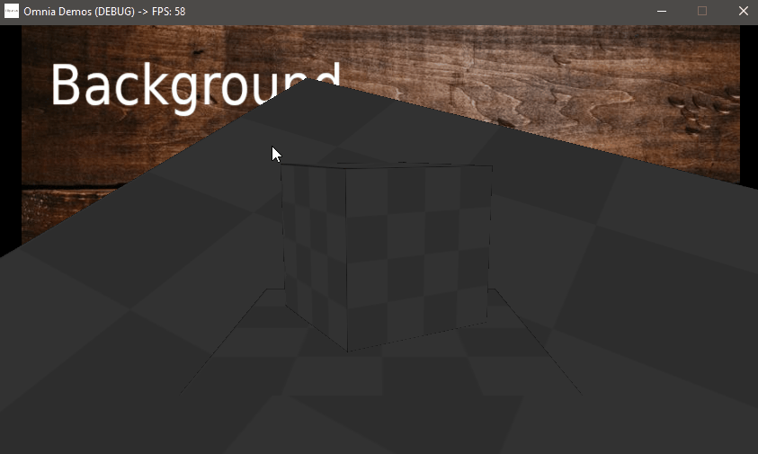
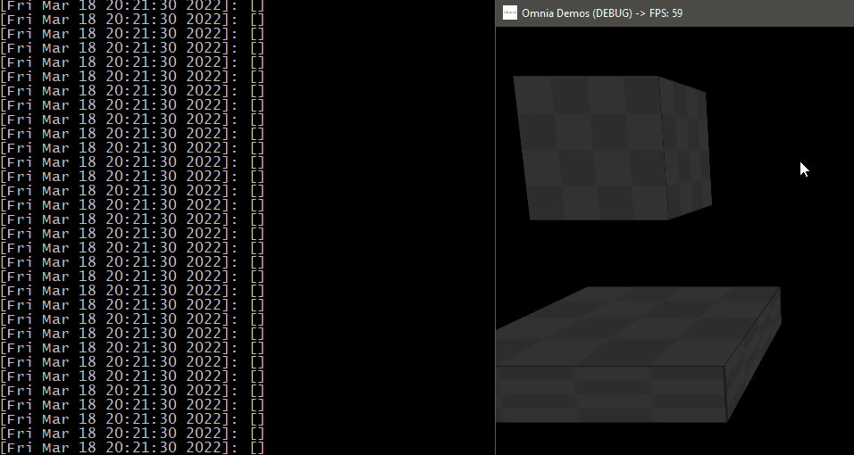
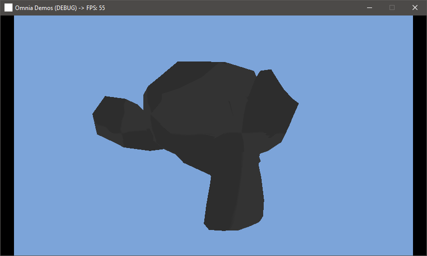

# [Omnia](https://github.com/Jean-LouisH/Omnia)

**This project is in pre-alpha**

[Omnia](https://github.com/Jean-LouisH/Omnia) is a game engine I'm developing for fun, study and technical demonstrations. It doubles as a real-time software framework for interactive applications. It is designed to be general purpose, data-driven, and lightweight.

The name "Omnia" stems from the prefix "Omni-" which means "all." It is loosely based on the term "Omnific" which means ["all-creating"](https://www.merriam-webster.com/dictionary/omnific).

# Table of Contents

* [Notable Features](#notable-features)
* [Notable Planned Features](#notable-planned-features)
* [Compilation Instructions](#compilation-instructions)
* [Documentation](#documentation)
  * [Objectives](#objectives)
  * [Design](#design)
  * [End User Manual](#end-user-manual)
  * [Scripting API](#scripting-api)
* [Demos](#demos)
* [License](#license)

# Notable Features

- Project-based, data-driven Applications

- Scenes of multiple SceneTree layers (2D and 3D)

- SceneTree EventBus for a publish/subscribe architecture

- C++ scripting via Native shared library builds
- Python scripting via a Virtual Machine with embeddable pip install support
- Entity-Component-System (ECS) architecture
- OpenGL Rendering Context with GLSL
- Game Controller and Haptic Feedback support
- Multithreaded Systems

# Notable Planned Features

- UI Framework built with UI Components and the UI System
- Physically Based Rendering
- An Editor Application built with the Engine, C++ and Python scripting
- Acoustic Audio Simulation
- Data-oriented Component property access using a ComponentPropertyPool for Systems
- Vulkan Rendering Context with SPIR-V
- Network Access for peer-to-peer gameplay

# Compilation Instructions

* Requires the [SDL2](https://www.libsdl.org/), [SDL2_mixer](https://www.libsdl.org/projects/SDL_mixer/) and [Embeddable Python 3.7](https://www.python.org/downloads/release/python-370/) libraries for your development platform.
* To be able to install third-party packages in Embeddable Python 3.7, uncomment the last line in python37._pth. Then download [get-pip.py](https://bootstrap.pypa.io/get-pip.py), place it in the embeddable python folder, and run > python get-pip.py. Install packages to the embeddable folder with > python -m pip install package-name.
* Include this source directory in CMake to generate a project from the top level CMakeLists.txt. 
* Set the `CMAKE_CONFIGURATION_TYPES` to the build configuration you want. 
* Use your C++ IDE or compiler of choice to build Omnia and Tests from the project.

# Documentation

## Objectives

.

## Design

[Design](Documentation/Design/Design.md)

## End User Manual

[End User Manual](Documentation/End_User_Manual/End_User_Manual.md)

## Scripting API

[Scripting API](Documentation/End_User_Manual/Scripting_API/Scripting_API.md)

## Demos

Loading Models

## License

[MIT License](LICENSE)