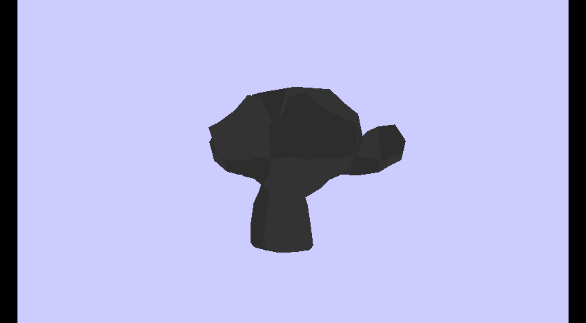
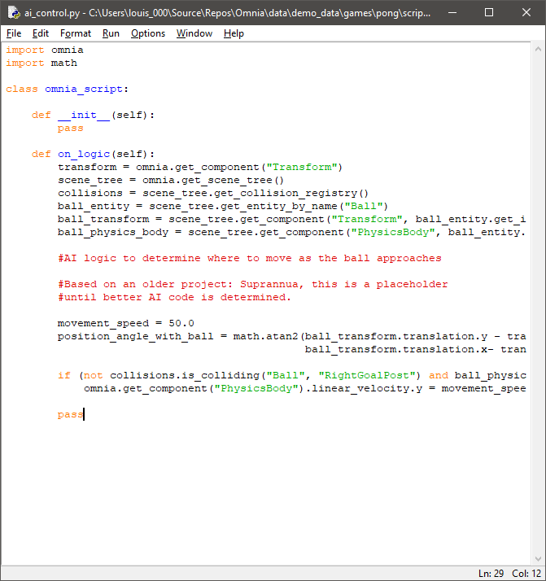
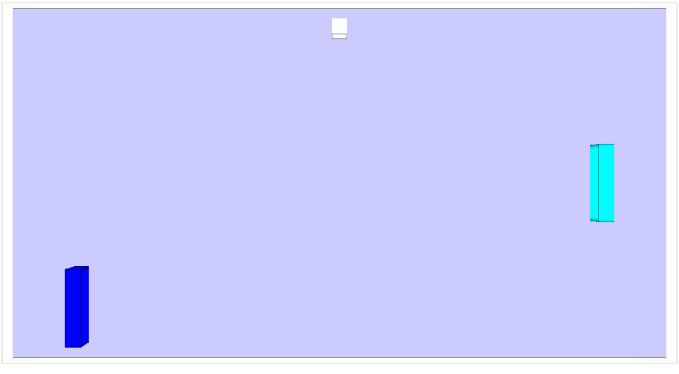

# [Omnia](https://github.com/Jean-LouisH/Omnia)

**This project is in pre-alpha**

[Omnia](https://github.com/Jean-LouisH/Omnia) is a game engine I'm developing for fun, study and technical demonstrations. It doubles as a real-time software framework for interactive applications. It is designed to be customizable, general purpose, data-driven, and lightweight.

The name "Omnia" stems from the prefix "Omni-" which means "all." It is loosely based on the term "Omnific" which means ["all-creating"](https://www.merriam-webster.com/dictionary/omnific).

# Table of Contents

* [Notable Features](#notable-features)
* [Compilation Instructions](#compilation-instructions)
* [Manual](#manual)
* [Demos](#demos)
* [License](#license)

# Notable Features

- Project-based, data-driven applications, deserialized as YAML files via yaml-cpp

- OpenGL 3.3 Rendering Context with GLSL, Scenes of multiple SceneTree layers (2D and 3D) via depth buffer refresh

- SceneTree EventBus for a publish/subscribe architecture

- Model loading via TinyGLTF, including Mesh and Material texture maps

- Python VM scripting via pybind11 with game loop calls to Python and Engine API calls from Python. Imports, including pip installed packages are supported.

- C++ scripting via native shared library builds

- Fully customizable as a core framework loading custom Asset, Component and System classes on initialization

- Entity-Component-System (ECS) architecture
- Game Controller and Haptic Feedback support
- Multithreaded Systems

# Dependencies

- [Embeddable Python 3.7](https://www.python.org/downloads/release/python-370/)
- [GLAD](https://glad.dav1d.de/)
- [OpenGL Mathematics](https://github.com/g-truc/glm)
- [Pybind11](https://github.com/pybind/pybind11)
- [SDL2](https://www.libsdl.org/)
- [SDL2_mixer](https://www.libsdl.org/projects/SDL_mixer/)
- [STB Image](https://github.com/nothings/stb)
- [TinyGLTF](https://github.com/syoyo/tinygltf)
- [YAML-CPP](https://github.com/jbeder/yaml-cpp)

# Compilation Instructions

* Get the dependency libraries listed above.
* To be able to install third-party packages in Embeddable Python 3.7, uncomment the last line in python37._pth. Then download [get-pip.py](https://bootstrap.pypa.io/get-pip.py), place it in the embeddable python folder, and run `> python get-pip.py`. Install packages to the embeddable folder with `> python -m pip install package-name`.
* Include this source directory in CMake to generate a project from the top level CMakeLists.txt. 
* Set the `CMAKE_CONFIGURATION_TYPES` to the build configuration you want. 
* Use your C++ IDE or compiler of choice to build Omnia and Tests from the project.

# Manual

# Demos

- Pong [In progress...]

# Acknowledgements

# License

MIT License

Copyright (c) 2020 Jean-Louis Haywood

Permission is hereby granted, free of charge, to any person obtaining a copy
of this software and associated documentation files (the "Software"), to deal
in the Software without restriction, including without limitation the rights
to use, copy, modify, merge, publish, distribute, sublicense, and/or sell
copies of the Software, and to permit persons to whom the Software is
furnished to do so, subject to the following conditions:

The above copyright notice and this permission notice shall be included in all
copies or substantial portions of the Software.

THE SOFTWARE IS PROVIDED "AS IS", WITHOUT WARRANTY OF ANY KIND, EXPRESS OR
IMPLIED, INCLUDING BUT NOT LIMITED TO THE WARRANTIES OF MERCHANTABILITY,
FITNESS FOR A PARTICULAR PURPOSE AND NONINFRINGEMENT. IN NO EVENT SHALL THE
AUTHORS OR COPYRIGHT HOLDERS BE LIABLE FOR ANY CLAIM, DAMAGES OR OTHER
LIABILITY, WHETHER IN AN ACTION OF CONTRACT, TORT OR OTHERWISE, ARISING FROM,
OUT OF OR IN CONNECTION WITH THE SOFTWARE OR THE USE OR OTHER DEALINGS IN THE
SOFTWARE.